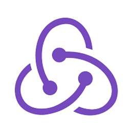

<h1 align='center'>CONTACTS</h1>

The contact-saving app is a useful tool for organizing and accessing contact information. It allows users to save basic and additional contact information, synchronize with other apps and services, search for contacts, and backup data to prevent loss. It is essential for staying connected with friends, family, and colleagues.

---

## Table of Contents

1. [Setup](#setup-installation)
2. [Manual](#manual)
3. [Contributing](#contributing)
4. [technology's](#technologys-ecosystem)

---

### Setup Installation

#### Prerequisites

Before using this application, make sure you have the following prerequisites installed on your system:

##### Mandatory Prerequisites

- [Node.js](https://nodejs.org/en/download/): This is a JavaScript _runtime environment_ that is required to run the application. Follow the instructions on the official Node.js website to download and install the latest version for your operating system.

> WARNING: **Node.js 16** or higher is required | **NPM 8** or higher is required |

- [PostgreSQL](https://www.postgresql.org/download/): This is an open-source _relational database management system_ that is required to store and manage the data for the application. Follow the instructions on the official **PostgreSQL** website to download and install the latest version for your operating system.

##### Optional Prerequisites

- **PNPM**: This is a fast, disk space efficient alternative to the default npm client used by Node.js. While it is not required to use this client, it is recommended for faster installations and better disk usage. To install _PNPM_, run the following command:

```bash
npm install -g pnpm
```

> WARNING: **PNPM 6** or higher is required

Once you have installed all of the mandatory prerequisites and optionally installed _PNPM_, you are ready to use the application.

### Installation and Usage

To use this application, follow the steps below:

#### Installing Dependencies

1. Open a terminal window and navigate to the root directory of the application.

2. Run the following command to install the necessary dependencies using npm:

```bash
npm install
```

Alternatively, if you have installed _PNPM_, you can run the following command:

```bash
pnpm install
```

#### Configure the Connection

1. Open the database.module.ts file in your project.

address of the file **/backend/src/config/**

2. Add the following code to import the TypeOrmModule and configure the connection to your Postgres database:

```TS
import { Module } from '@nestjs/common';
import { TypeOrmModule } from '@nestjs/typeorm';
import User from '../users/user.entity';

@Module({
 imports: [
  TypeOrmModule.forRoot({
   type: 'postgres',
   host: 'localhost',
   port: 5432,
   username: 'postgres',
   password: '*****',
   database: 'contacts',
   entities: [User],
   synchronize: true,
  }),
 ],
})
export default class DatabaseModule {}
```

Replace the values for **host**, **port**, **username**, **password**, and _database_ with the appropriate values for your _Postgres_ _database_.
The entities property specifies the location of your _TypeORM_ entities, which are used to map your database tables to your Nest.js application.
The synchronize property is set to true to automatically create database tables if they do not exist. You can set this to false if you want to manage the database schema manually.

3. Save the app.module.ts file.

4. Run the application using

#### Running the Backend

1. After installing the dependencies, run the following command to start the backend server using npm:

```bash
npm run start:dev -w backend
```

If you have installed PNPM, run the following command instead:

```bash
pnpm run start:dev -w backend
```

This will start the backend server on <http://localhost:3001>.

#### Running the Frontend

1. To start the frontend server, run the following command using npm:

```bash
npm run dev -w frontend
```

If you have installed PNPM, run the following command instead:

```bash
pnpm run dev -w frontend
```

This will start the frontend server on <http://localhost:3000>.

2. Open a web browser and navigate to <http://localhost:3000> to access the application.

You are now ready to use the application!

### Manual

In a database, a table is a collection of related data organized in rows and columns. The database schema defines the structure of the table, including the names and data types of its columns. In this case, we have a table called "public.users" with the following columns:

1. id - an integer that serves as the primary key for each record in the table. This means that each record is uniquely identified by its id value.

2. names - a character varying field that stores the user's first and middle name.

3. lastNames - a character varying field that stores the user's last name.

4. email - a character varying field that stores the user's email address.

5. phone - a character varying field that stores the user's home phone number.

6. cellPhone - a character varying field that stores the user's cell phone number. This field has a unique constraint, which means that each value in this field must be unique across all records in the table.

7. address - a character varying field that stores the user's street address.

In addition to these columns, the table has two indexes: a primary key index on the id column and a unique constraint index on the cellPhone column.

The purpose of this table is to store information about users in the system. By using this table, we can easily retrieve information about a user based on their unique id or cell phone number. This information could be used for various purposes, such as user authentication, contact management, or targeted marketing.

### Contributing

Recently, I had the opportunity to learn some new technologies and best practices that have been invaluable to my development skills. Specifically, I delved into the _Nestjs_ framework, which utilizes the Model-View-Controller (_MVC_) design pattern, and the _TypeORM_ Object Relational Mapping (_ORM_) tool to create scalable and maintainable applications.

Moreover, I had the chance to sharpen my frontend skills by practicing with React, Redux, Sass, and Bootstrap. With React, I learned how to create reusable UI components, and with Redux, I learned how to manage the state of a React application in a centralized and efficient way. Additionally, I learned how to use Sass to write more concise and maintainable CSS, and Bootstrap to create responsive and mobile-friendly user interfaces.

Overall, my experience with Nestjs, TypeORM, and these frontend technologies has been extremely rewarding, and I look forward to incorporating them into my future projects. I feel more confident in my ability to build high-quality applications that are both efficient and maintainable, and I am excited to continue learning and improving my skills.

### Technologys Ecosystem

| Name          | Dependencies                                         | Description                                                                                                                                                                                                                                                                                                                                                                                                                                                                              |
| ------------- | ---------------------------------------------------- | ---------------------------------------------------------------------------------------------------------------------------------------------------------------------------------------------------------------------------------------------------------------------------------------------------------------------------------------------------------------------------------------------------------------------------------------------------------------------------------------- |
| React         |          | React is a free and open-source front-end JavaScript library for building user interfaces based on UI components. It is maintained by Meta and a community of individual developers and companies.                                                                                                                                                                                                                                                                                       |
| Redux Toolkit |  | Simple. Includes utilities to simplify common use cases like store setup, creating reducers, immutable update logic, and more. ; Opinionated.                                                                                                                                                                                                                                                                                                                                            |
| Nest.js       |         | is a framework that helps build Node. JS server-side applications. The Nest framework is built using TypeScript which allows developers to build highly scalable and testable applications. Built on top of Express.                                                                                                                                                                                                                                                                     |
| TypeORM       |       | TypeORM is an ORM that can run in NodeJS, Browser, Cordova, PhoneGap, Ionic, React Native, NativeScript, Expo, and Electron platforms and can be used with TypeScript and JavaScript (ES5, ES6, ES7, ES8). Its goal is to always support the latest JavaScript features and provide additional features that help you to develop any kind of application that uses databases - from small applications with a few tables to large scale enterprise applications with multiple databases. |
| Sass          |          | Sass is a preprocessor scripting language that is interpreted or compiled into Cascading Style Sheets. SassScript is the scripting language itself. Sass consists of two syntaxes. The original syntax, called "the indented syntax," uses a syntax similar to Haml.                                                                                                                                                                                                                     |
| Bootstrap     |      | Bootstrap is a free and open-source CSS framework directed at responsive, mobile-first front-end web development. It contains HTML, CSS and JavaScript-based design templates for typography, forms, buttons, navigation, and other interface components.                                                                                                                                                                                                                                |
| Node.js       |       | Node.js is a cross-platform, open-source server environment that can run on Windows, Linux, Unix, macOS, and more. Node.js is a back-end JavaScript runtime environment, runs on the V8 JavaScript Engine, and executes JavaScript code outside a web browser.                                                                                                                                                                                                                           |
| PostgreSQL    |     | PostgreSQL, also known as Postgres, is a free and open-source relational database management system emphasizing extensibility and SQL compliance. It was originally named POSTGRES, referring to its origins as a successor to the Ingres database developed at the University of California, Berkeley                                                                                                                                                                                   |
| TypeScript    |    | TypeScript is a free and open source high-level programming language developed and maintained by Microsoft. It is a strict syntactical superset of JavaScript and adds optional static typing to the language. It is designed for the development of large applications and transpiles to JavaScript.                                                                                                                                                                                    |
